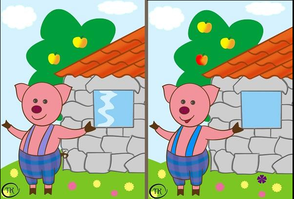
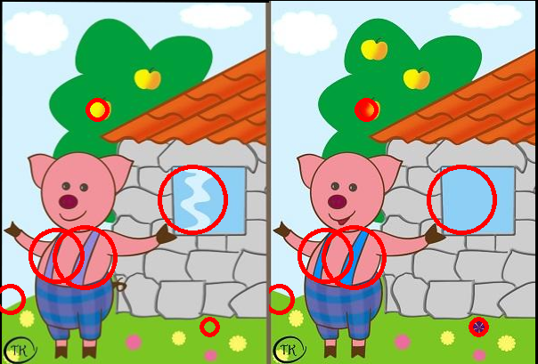
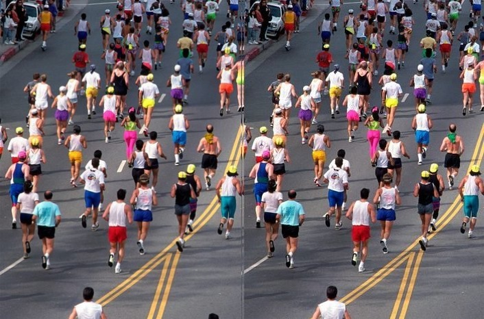
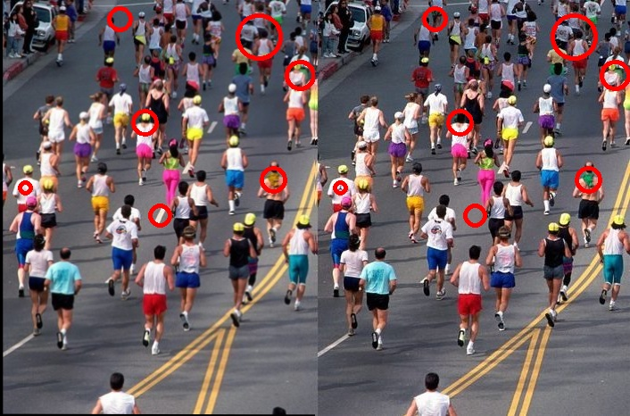
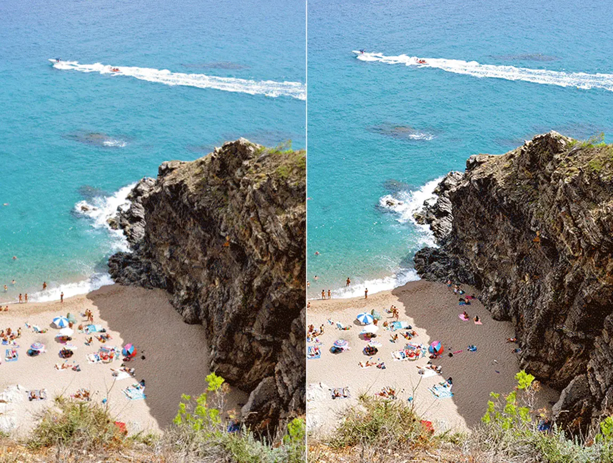
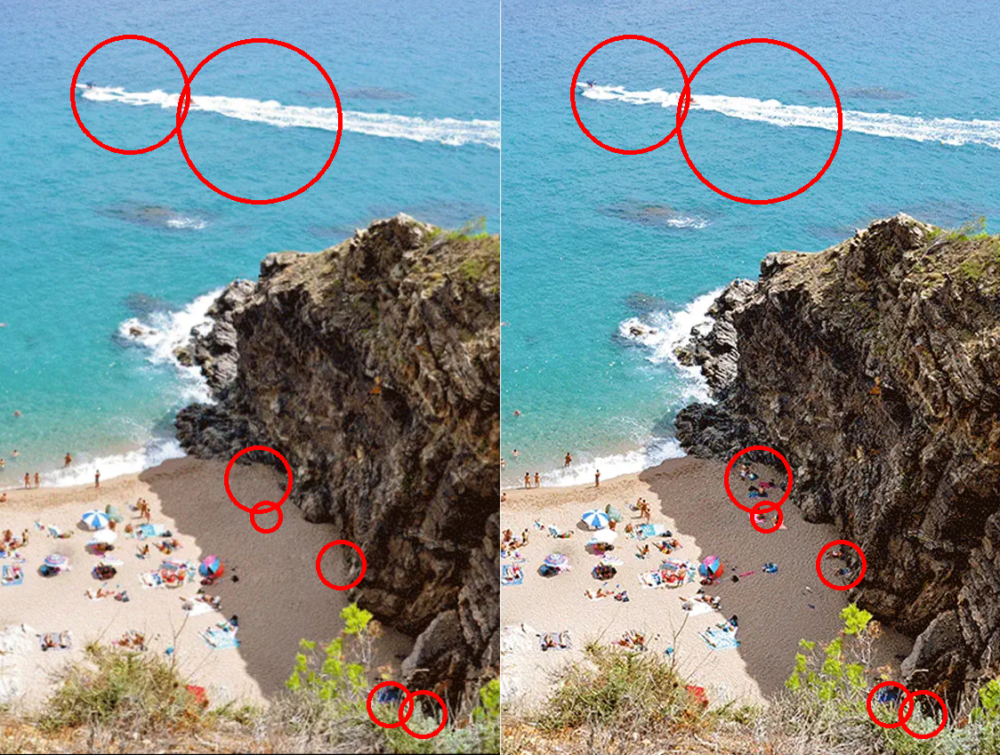
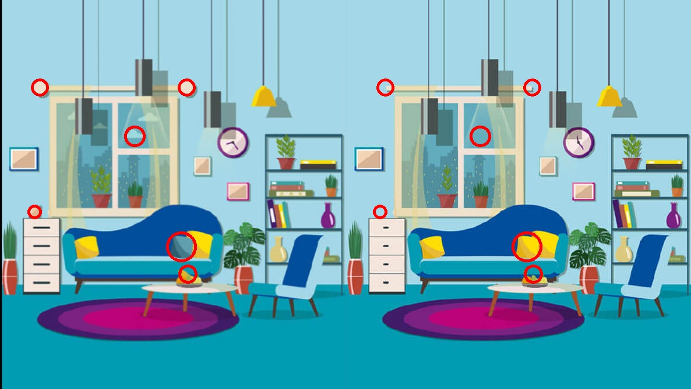

# Spot-the-difference

This project tries to automate the game that I am sure many of you must have played in your childhood (or adulthood too) especially while reading the newpapers early morning with a cup of tea (oh! the good old days)

- [Notebook (research](https://www.kaggle.com/code/kambojharyana/spot-the-difference-research?scriptVersionId=109173255)
- [Notebook (final code)](https://www.kaggle.com/code/kambojharyana/spot-the-difference-final-code)

# Results -> 
NOTE: The inputs are given as two separate images, as you can see in the examples notebooks and scripts, the two images are aligned below for better representation.

### Input Image 

### Result 

 

### Input Image 

### Result 

 

### Input Image 

### Result 

### INPUT IMAGE (this has only one differnce) Atleast what I can found. 

### Output Image (check on the left hand side, just above the person's outstretched hand)

### Input Image 

### Output Image

